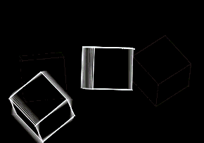

# C4D → ILDA Export

**Version 1.0.0**



*Example output decoded back from an `.ild` file — lit strokes in colour, blanked galvo travel moves dashed.*

A Cinema 4D **command plugin** that exports **spline animations** to the **ILDA Image
Data Transfer Format** (`.ild`) for laser projection. One animation frame → one ILDA
frame. Pure Python, no build step, no third-party dependencies. Runs on R21 (Python 2.7)
through 2025 (Python 3).

It registers a menu command rather than a File → Export handler: R21's Python binding
mishandles `SceneSaverData` registration (it tries to *call* the saver instance and
fails), so the robust `CommandData` route is used instead.

The laser-facing logic (byte encoding, blanking, normalisation) lives in two
C4D-independent modules so it is unit-tested on its own and reusable elsewhere
(e.g. inside a laser-synth pipeline).

## Files

| File | Role | Needs C4D |
|------|------|-----------|
| `ilda_export.pyp` | The command plugin: scene traversal, spline/mesh sampling, projection, dialog, Save | yes |
| `laser_build.py`  | Projected polylines → global scaling + blanking → ILDA frames | no |
| `ilda_format.py`  | ILDA reader/writer (formats 4 & 5, true colour) | no |
| `res/`            | Minimal plugin resource folder (optional for a command plugin) | — |
| `test_ilda_format.py`, `test_laser_build.py` | Test suites for the pure modules | no |
| `demo_rotating.ild` | Example output (rotating square + pulsing circle, 60 frames) | no |
| `preview.png`     | Rendered preview of the demo used in this README | — |
| `LICENSE`         | CC BY-NC-SA 4.0 license | — |

## Install

Copy the whole folder into your C4D user plugins directory, keeping the layout:

```
<C4D user folder>/plugins/ilda_export/
    ilda_export.pyp
    ilda_format.py
    laser_build.py
    res/
        c4d_symbols.h
        strings_us/
            c4d_strings.str
```

The `res/` folder is optional for this command plugin (a command with no icon needs no
resource) but is harmless if present.

Find the user folder via **Edit → Preferences → Open Preferences Folder** in C4D
(the `plugins/` subfolder). Install into **exactly one** plugins location — having the
same plugin in two folders makes C4D report an ID collision. Restart C4D.

**Run it:** Extensions menu → **"Export ILDA (.ild)..."**, or press **Shift+C**
(Commander) and type *Export ILDA*. A Save dialog appears; choose where to write the
`.ild`. A summary dialog reports how many frames were written.

> `PLUGIN_ID` is set to a personal PluginCafe ID. Get your own free ID at
> <https://plugincafe.maxon.net/> if you fork this.

## What gets exported

When you run the command an **options dialog** appears first (what to export and how to
project), then a Save dialog.

**Splines** (on by default): spline primitives (circle, rectangle, star…), text splines,
formula/MoSplines, and the source splines of generators — anything `GetRealSpline()`
returns. Each spline segment becomes one continuous lit stroke; the laser blanks
(turns off) while travelling between strokes.

**Mesh objects** (cubes, spheres, cylinders, editable polygon objects, generator
output) export as their **edges** when *Export mesh objects* is enabled in the dialog:

- **All edges** — every mesh edge as a line segment (a cube → 12 edges). Faithful but
  busy; the laser blanks between disconnected edges.
- **Facing edges (front only)** — edges of front-facing polygons, with back edges culled
  so you don't draw the far side obscured by the object. Keeps the interior edges of the
  visible surface (the front wireframe) — a superset of the silhouette.
- **Silhouette edges** — only the outline for the chosen viewpoint (a cube seen front-on
  → a 4-edge square; seen corner-on → a hexagon). The cleanest laser look.

The *Facing edges* mode needs to know which side faces the viewer. In the orthographic
*Front (XY)* projection this defaults to C4D's convention (+Z into the screen, so −Z is
toward you). If facing mode shows the **back** of your object, set `"flip_facing": True`
in the CONFIG block. In *Active camera* projection the direction is taken from the camera,
so no flip is needed.

Mesh edges are read from each object's final cache after evaluation, so parametric
primitives and simple deformers work without making them editable. Very complex
generators (heavy MoGraph, nested effectors) may not resolve cleanly — if a mesh doesn't
come through, make it editable (press **C**) and try again.

**Colour** comes from each object's *Basic → Display Colour* (set it to "On"). Objects
without a display colour use `default_color`. Per-material / per-point colour is not
sampled in this version.

## Configuration

Edit the `CONFIG` block at the top of `ilda_export.pyp`:

| Key | Meaning |
|-----|---------|
| `projection` | `"xy"` = orthographic front view (world X,Y; deterministic). `"camera"` = perspective through the active scene camera (handles an animated camera). |
| `invert_y` | Flip Y (laser Y is up; screen Y is down). Toggle if the image is upside-down. |
| `samples_per_segment` | Interpolated points per spline segment. Higher = smoother curves, more points. |
| `close_closed_splines` | Append the start point to closed loops so they visually close. |
| `blank_dwell` | Blanked travel points inserted before each stroke (galvo arrival time). |
| `on_dwell` | Repeats of a stroke's first lit point (galvo settle before drawing). |
| `margin` | Safe border, as a fraction of the ±32767 device range. |
| `true_color_3d` | `False` → ILDA format 5 (2D). `True` → format 4 (3D, keeps depth). |
| `frame_step` | Export every Nth frame. |
| `use_preview_range` | Use the loop/preview range instead of the full document range. |
| `max_points_per_frame` | Soft guard; strokes beyond it are dropped for that frame (ILDA hard max is 65535). |

Scaling is **global across the whole clip** (one bounding box for all frames) so the
image does not rescale ("breathe") from frame to frame.

## ILDA specifics

- Writes true-colour formats only: **format 5** (2D) and **format 4** (3D). No palette.
- Status byte: bit 7 = last point of frame, bit 6 = blanking (1 = laser off).
- Colour is stored **B, G, R** on disk (per spec), 0–255 per channel.
- Coordinates are clamped to the signed 16-bit range (−32768…32767).
- Each file ends with a zero-record header (the ILDA EOF marker).

## Tests

The laser-facing logic is covered without needing Cinema 4D:

```bash
python3 test_ilda_format.py   # header layout, BGR order, status bits, round-trip, EOF
python3 test_laser_build.py   # blanking pattern, device-range fit, global scale, invert-Y
```

`demo_rotating.ild` (a rotating square + pulsing circle, 60 frames) is generated by the
same `laser_build` + `ilda_format` path the plugin uses — a quick way to confirm your
laser software / DAC chain reads the output before wiring up C4D.

## Version notes

Works on **C4D R21 (Python 2.7) through 2025 (Python 3)**. The three pure Python files
are written to run under both interpreters (no dataclasses, no f-strings, explicit
float division). Three API calls vary slightly between releases and are marked
`##VERIFY##` in `ilda_export.pyp`:

1. `BaseObject.GetRealSpline()` — spline extraction.
2. `c4d.utils.SplineHelp.InitSplineWith` / `InitSpline` — curve sampling.
3. `CAMERAOBJECT_FOV` / `CAMERAOBJECT_FOV_VERTICAL` — perspective FOV (camera mode).

Each has a fallback (raw control points; XY projection), so export still succeeds if a
call differs on your build — check the Python console for `[ILDA]` messages.

## Troubleshooting

**Command doesn't appear (Extensions menu / Shift+C).** The plugin failed to register.
Open the console (**Script → Console** in R21) and look for red `[ILDA]` or traceback
text. A `SyntaxError` / `ImportError` at load means one of the three files is missing or
a stray Python-3-only build is present — make sure `ilda_export.pyp`, `ilda_format.py`
and `laser_build.py` sit together in one folder. On success the console prints
`[ILDA] command registered (id ...)`.

**`TypeError: '...' object is not callable` from `SceneSaverData`.** R21's Python
binding cannot register a scene saver via instance (it tries to call it). This build
uses `CommandData` instead, which avoids the problem. If you see this, you're running an
older scene-saver version of the `.pyp` — replace it with this one.

**`RuntimeError: The plugin ID '...' collides with another plugin ID`.** Either the
plugin is installed in more than one folder, or an earlier scene-saver build of the
`.pyp` half-registered the ID before failing (the old saver path returned False yet
reserved the ID, so a retry collided with itself). Fixes: (1) keep exactly one copy of
the plugin — check both `C:\Program Files\Maxon Cinema 4D R21\plugins\` and the user
preferences `plugins\` folder (**Edit → Preferences → Open Preferences Folder**);
(2) use this `CommandData` build, which registers cleanly on the first try;
(3) fully restart C4D, since a stuck ID only clears on restart. The console prints
`[ILDA] ... loading from: <path>` once per copy — more than one line means duplicates.

**Folder nesting.** After extracting, confirm the path is
`.../plugins/ilda_export/ilda_export.pyp` and not doubly nested
(`.../plugins/ilda_export/ilda_export/ilda_export.pyp`).

## Version history

- **1.0.0** — First public release. Spline export; mesh edge export with all / facing /
  silhouette modes; front-orthographic and active-camera projection; blanking, global
  scaling and dwell control; ILDA formats 4 (3D) and 5 (2D). Runs on C4D R21 (Python 2.7)
  through 2025 (Python 3).

## License

Released under **Creative Commons Attribution-NonCommercial-ShareAlike 4.0
International (CC BY-NC-SA 4.0)** — see [`LICENSE`](LICENSE) or the full legal text at
<https://creativecommons.org/licenses/by-nc-sa/4.0/>.

In short: free to use, modify, and share with attribution, but not for commercial
purposes (including selling this software or derivatives of it), and any derivative
work must be shared under this same license. This is a summary, not a substitute for
the full license text.
